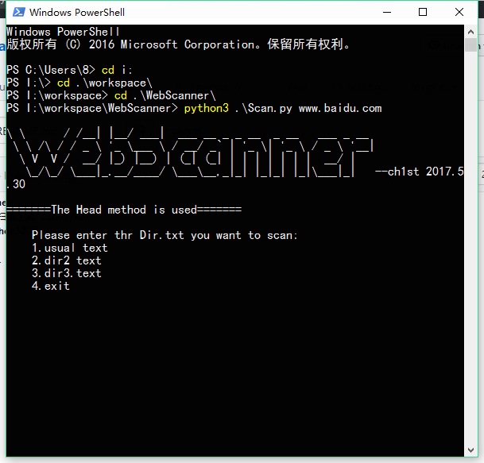
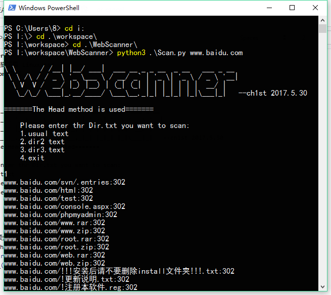

# WebScanner
一款网站目录扫描工具 Linux/mac 
### 基于Python3语言
使用操作:
Scan.py url
```html
\ \      / /__| |__/ ___|  ___ __ _ _ __  _ __   ___ _ __
 \ \ /\ / / _ \ '_ \___ \ / __/ _` | '_ \| '_ \ / _ \ '__|
  \ V  V /  __/ |_) |__) | (_| (_| | | | | | | |  __/ |
   \_/\_/ \___|_.__/____/ \___\__,_|_| |_|_| |_|\___|_|   --ch1st 2017.5.30
   =======The Head method is used=======

    Please enter thr Dir.txt you want to scan:
    1.usual text
    2.dir2 text
    3.dir3.text
    4.exit

```
   
  > 前三个选项分别对应三个字典.
    没有针对php,asp,aspx,jsp等字典.
  
  
  ## 采用了Head方法快速获取响应头
    单纯的过滤了404.
    
 ## 雏鸡版本,见谅.
    在7月份之前会出成品,成品会实现的功能
    1.多线程扫描
    2.用户自定义字典扫描
    3.自定义黑名单过滤
    4.使用Sleep5秒之后更换User-Agent头达到过waf的效果
    
